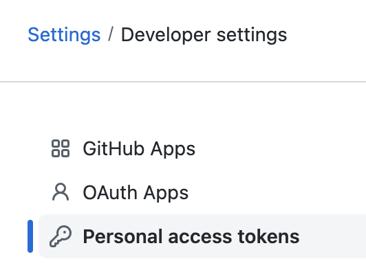
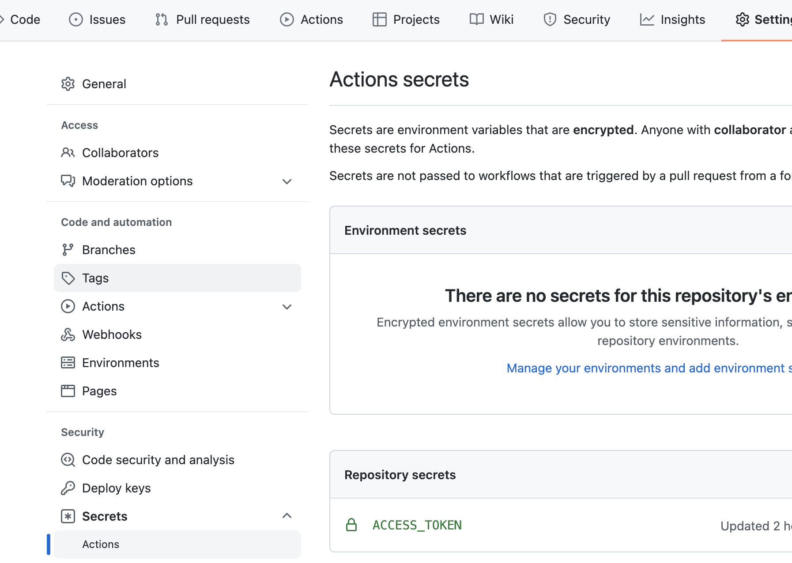

> 本文主要讲解用Hexo做的博客系统如何通过GitHub Actions实现CI/CD。

### 工作原理
简单说下GitHub Actions的工作原理：在项目根目录下创建`.github/workflows`文件夹，然后在该文件夹下创建一个后缀名为`.yml`的配置文件，当我们通过某一个动作触发GitHub Actions时，该配置文件会被解析，并执行相应的操作。
一个工作流程`workflow`可以有多个任务`job`，每个任务又能分成几个步骤`step`，每个步骤可以一次执行多个命令`action`。

### 实现过程
1. 在GitHub个人设置`Settings/Developer settings`下的`Personal access tokens`新建一个`ACCESS_TOKEN`

2. 然后到项目下的`settings/Secrets/Actions下新建一个repo secrect，值为第一步创建好的值，key为`ACCESS_TOKEN`（随意起，但必须与.yml中的一致）

3. 还是使用双分支的形式处理，因为最终GitHubPage项目的主分支要的还是`hexo g`出来的html
4. 配置`.yml`文件，内容如下，可见`[这里](https://github.com/hyxkiller/hyxkiller.github.io/blob/action-source/.github/workflows/deploy.yml)`：
  ```
  name: blog
  on: 
    push:
      branches:
        - action-source
  jobs:
    build-and-deploy:
      runs-on: ubuntu-latest
      env:
        TZ: Asia/Shanghai
      
      steps:
      - name: Checkout source
        uses: actions/checkout@v2
        with:
          submodules: true
      - name: Setup Node.js
        uses: actions/setup-node@v1
        with:
          node-version: '14.x'

      - name: Install dependencies & Generate static files
        run: |
          node -v
          npm i -g hexo-cli
          npm i
          hexo clean
          hexo g
      - name: Deploy to Github Pages
        env:
          GIT_NAME: your git name
          GIT_EMAIL: your git email
          REPO: your repo name
          ACCESS_TOKEN: ${{ secrets.ACCESS_TOKEN }}
        run: |
          cd ./public && git init && git add .
          git config --global user.name $GIT_NAME
          git config --global user.email $GIT_EMAIL
          git commit -m "Github Actions Auto Builder at `date +"%Y-%m-%d %H:%M"`"
          git push --force --quiet "https://$ACCESS_TOKEN@$REPO" master:master
  ```
5. 将改动push到github后，在Github的Actions下可见此次工作流的执行过程。

### 过程解释
1. `name`：指当前workflow的名称
2. `on`：指定触发workflow的条件，通常是某些事件，我们这里是当有`push`操作时执行;`branches`是指定某个分支push才执行
3. `jobs`：表示要执行的一项或多项任务，我们这里要做的就是把博客内容通过`hexo g`的方式推到`master`分支上
4. `runs-on`：指定运行所需要的虚拟机环境。它是必填字段。目前可用的虚拟机如下。
```
ubuntu-latest，ubuntu-18.04或ubuntu-16.04
windows-latest，windows-2019或windows-2016
macOS-latest或macOS-10.14
```
5. `steps`：指定node版本 -> 通过hexo的一系列命令最后生成相应的html文件 -> 将生成的文件推到远程仓库的master上
6. 需要注意的是`ACCESS_TOKEN: ${{ secrets.ACCESS_TOKEN }}`，即为之前创建的密钥，常量命名需保持一致

至此，你已经可以再你的Github Page上开心的看到你的杰作了，以后更新博客只需要写完文件后push到该分支即可。