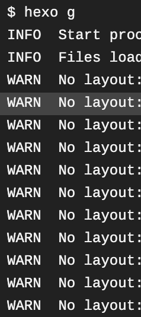
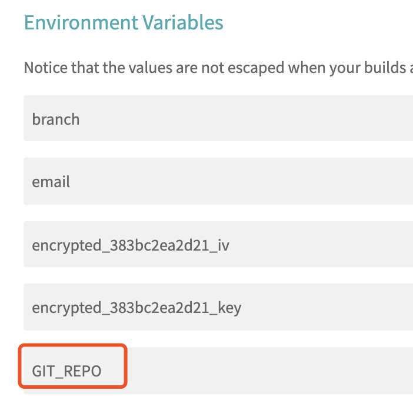

## 写在前面
任何一个项目的手动部署都会让开发觉得很繁琐，所以学一点CI/CD的简单知识也有一定必要。经过调研发现和github集成较好的是travis这一工具。当然也是为了解决换了电脑还要重新配置hexo那一套东西的问题。
至于travis与github的项目关联就不再赘述，网上很多博客都有介绍。主要说一下配置过程中遇到的问题。

## 整体思路
因为hexo集成到github的master分支的是public下的静态文件，所以采用另一分支保存hexo配置及``.travis.yml``的方案，这样随时随地登录github就可以修改博客内容并提交一次commit，告知travis执行新的部署工作。


## 可能遇到的问题
#### 本地可以生成静态文件，travis执行``hexo g``出现No layout的情况(另一表现是生成的html都是空白的)

原因是使用next主题，但是没有把next主题的文件push到github，因为在本地装这个主题的时候next文件夹内部也有.git, .gitignore文件，这时候在github里这个文件是点不开的，需要执行以下命令：
```
rm -rf .git .gitignore
git rm -r --cached themes/next      // 删除next的本地缓存
```
然后重新提交，即可通过travis正常生成静态文件。

---

#### 服务器无法下载travis
1. 执行``gem sources -l``, 如果结果是``https://rubygems.org/``, 会有源的问题，先换源
```
gem sources --add https://gems.ruby-china.com/ --remove https://rubygems.org/
```
2. 然后更新gem
```
gem update --system
```
3. 然后按照网上很多人的博客是可以进行第四步下载了，但我这遇到一个大概意思是服务器ruby版本是2.0，但下载travis 的时候用的是1.10版本的ruby的问题，之后装了一些包才整好。
```
yum install -y ruby-devel rubygems
```
4. 下载travis
```
gem install travis
```

---

#### 密钥名字的问题
在执行将public文件push到master分支的过程中，需要在地址前写用于github和travis匹配的key，这里的名字是设置在travis环境变量里的``变量名``！

```
git push --force --quiet "https://${GIT_REPO}@${GH_REF}" master:master
```

---

#### master commit树被清空
```
after_success:
  - cd ./public
  - git init
  - git config user.name "yourname"
  - git config user.email "your email"
  - git add .
  - git commit -m "update"
  - git push --force --quiet "https://${GH_TOKEN}@${GH_REF}" master:master
```
如果是这样执行，每次都是将public目录下的文件重新生成了一个git项目，然后强制覆盖提交到了master分支下，这就是问题的所在。
需要做以下修改：
```
after_success:
    - git clone https://${GH_REF} .deploy_git
    - cd .deploy_git
    - git checkout master
    - cd ../
    - mv .deploy_git/.git/ ./public/
    - cd ./public
    - git config user.name "yourname"
    - git config user.email "your email"
    - git add .
    - git commit -m "Travis CI Auto Builder"
    - git push --force --quiet "https://${GH_TOKEN}@${GH_REF}" master:master
```
先将博客项目clone到本地的``.deploy_git``目录下（目录名可自定义）,然后切换到master分支，将master分支下的.git目录拷贝到了public目录下，接着继续后面的commit操作。