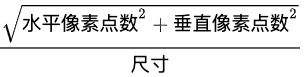
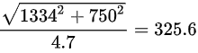

## 一、理解几个长度单位概念
#### 英寸(inch)
一般用英寸描述屏幕的物理大小，是屏幕对角线长度，如电脑显示器的13.3、15.4，手机显示器的4.8、5.7等使用的单位都是英寸。
#### PPI(pixel per inch)
每英寸包括的像素数。    
可以描述屏幕和图片的清晰度，数值越高越清晰。  
``PPI``计算方法:

以IPhone6举例，ppi = ，每英寸约含有326个物理像素点。
#### DPI(dot per inch)
每英寸包括的点数。这个点是一个抽象的单位，可以是屏幕像素点、图片像素点、打印机的墨点。  
#### DP(device independent pixels)
设备独立像素。  
iPhone X的设备独立像素为375×812，IPhone 6p/7p/8p为414×736，IPhone 6/7/8为375×667，IPhone5/5s/5c/SE为320×568。
#### DPR(device pixel ratio)
物理像素和设备独立像素的比值。
浏览器通过``window.devicePixelRatio``获取dpr；css通过``min-device-pixel-ratio``区分dpr；在RN中，通过``PixelRatio.get()``获取dpr。
iPhone X/XS/XS Max/6p/7p/8p的dpr为3，IPhone 6/7/8/5/5s/5c/SE/XR为2。
#### px、pt、dp相互转换
在iOS、Android、RN包括Flutter的开发中单位样式都使用的是设备独立像素。整理来讲，iOS为pt，其他是dp。  
dp/pt和px：
```
px = dp * ppi / 160
dp = px * 160 / ppi
```
## 二、视口
#### 布局视口，视觉视口，理想视口
+ 布局视口(layout viewport)：网页的布局的基准窗口，PC端就是浏览器当前窗口大小，移动端会赋予一个默认值为980px。
+ 视觉视口(visual viewport)：用户通过屏幕看到的区域。
+ 理想视口(ideal viewport)：网站页面在移动端展示的理想大小。

#### Meta viewport
``<meta>``元素表示那些不能由其它HTML元相关元素之一表示的任何元数据信息，它可以告诉浏览器如何解析页面。
```html
<meta name="viewport" content="width=device-width; initial-scale=1; maximum-scale=1; minimum-scale=1; user-scalable=no;">
```
参数含义：

value | 可能值 | 描述
--- | --- | ---
width | 正整数或device-width | 以pixels（像素）为单位， 定义布局视口的宽度。
height | 正整数或device-height | 以pixels（像素）为单位， 定义布局视口的高度。
initial-scale | 0.0 - 10.0 | 定义页面初始缩放比率。
minimum-scale | 0.0 - 10.0 | 定义缩放的最小值；必须小于或等于maximum-scale的值。
maximum-scale | 0.0 - 10.0 | 定义缩放的最大值；必须大于或等于minimum-scale的值。
user-scalable | 一个布尔值（yes或者no）| 如果设置为 no，用户将不能放大或缩小网页。默认值为 yes。

#### 移动端适配
由于设置了``width=device-width``和``initial-scale=1``，相当于理想视口等于布局视口（其中：``initial-scale = 理想视口宽度 / 视觉视口宽度``）。        
这时，一个css像素就等于一个设备独立像素。
#### 获取浏览器大小
+ window.innerHeight：获取浏览器视觉视口高度（包括垂直滚动条）。
+ window.outerHeight：获取浏览器窗口外部的高度。表示整个浏览器窗口的高度，包括侧边栏、窗口镶边和调正窗口大小的边框。
+ window.screen.Height：获取获屏幕取理想视口高度，这个数值是固定的，设备的分辨率/设备像素比
+ window.screen.availHeight：浏览器窗口可用的高度。
+ document.documentElement.clientHeight：获取浏览器布局视口高度，包括内边距，但不包括垂直滚动条、边框和外边距。
+ document.documentElement.offsetHeight：包括内边距、滚动条、边框和外边距。
+ document.documentElement.scrollHeight：在不使用滚动条的情况下适合视口中的所有内容所需的最小宽度。测量方式与clientHeight相同：它包含元素的内边距，但不包括边框，外边距或垂直滚动条。

## 三、 1px问题
```css
.border {
    border: 1px solid #000;
}
@media screen and (-webkit-min-device-pixel-ratio: 2){
    .border {
        border: 0.5px solid #000;
    }   
}
@media screen and (-webkit-min-device-pixel-ratio: 3){
    .border {
        border: 0.333333px solid #000;
    }   
}
```

## 四、移动端适配方案
#### vw+rem方案
+ vw: 1vw = window.innerWidth * 0.01
+ vh: 1vh = window.innerHeight * 0.01
+ vmin: vw和vh中的较小值
+ vmax: vw和vh中的较大值
 
整个屏幕宽为100vw，如果设计稿以iPhone 5为基准即320px，那么1px对应``100/320=0.3125vw``，100px对应``0.3125*100=31.25vw``，然后设置html的font-size为31.25vw，那么1rem为31.25vw<=>100px。
同理，iPhone 6的话根元素html的font-size为26.6666667vw。

## 五、适配刘海屏等
#### viewport-fit
```html
<meta name="viewport" content="viewport-fit=cover">
```
+ contain/auto: 可视窗口完全包含网页内容
+ cover: 网页内容完全覆盖可视窗口

#### env, constant
将顶部和底部合理放在安全区内，iOS11新增了两个CSS函数env(iOS >= 11.2)、constant(iOS < 11.2)，用于设定安全区域与边界的距离。   
函数内部可以是以下4个常量：
+ safe-area-inset-left: 安全区域距离左边边界距离
+ safe-area-inset-right: 安全区域距离右边边界距离
+ safe-area-inset-top: 安全区域距离顶部边界距离
+ safe-area-inset-bottom: 安全区域距离底部边界距离

```css
body{
    padding-top: constant(safe-area-inset-top);
    padding-top: env(safe-area-inset-top);
}
```

## 横屏适配
#### js检测
通过``orientationchange``事件来监听设备是否旋转，配合window.orientation属性判断当前是横屏还是竖屏，以便执行不同的操作。 
```js
window.addEventListener("orientationchange", () => {
    if (window.orientation === 180 || window.orientation === 0) { 
        // 正常方向或屏幕旋转180度(0: 竖屏模式/portrait, 180: 上线互换的竖屏)
        console.log('竖屏');
    };
    if (window.orientation === 90 || window.orientation === -90 ){ 
        // 屏幕顺时钟旋转90度或屏幕逆时针旋转90度
        console.log('横屏');
    }  
});
```
#### css检测
```css
@media screen and (orientation: portrait) {
  /*竖屏...*/
} 
@media screen and (orientation: landscape) {
  /*横屏...*/
}

```